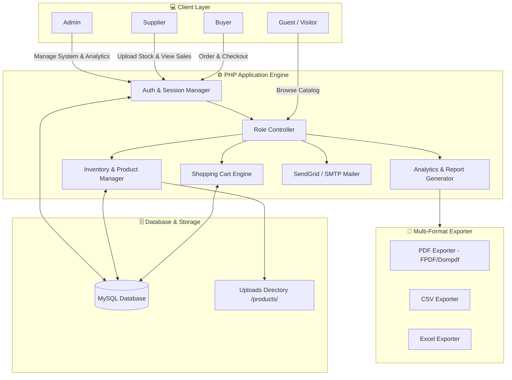

<div align="center">

# 📦 ProStock — Inventory Management System V1

[](https://www.php.net/)
[](https://www.mysql.com/)
[](https://sendgrid.com/)
[](https://developer.mozilla.org/en-US/docs/Web/HTML)
[](https://developer.mozilla.org/en-US/docs/Web/CSS)
[](https://developer.mozilla.org/en-US/docs/Web/JavaScript)
[](LICENSE)

*A state-of-the-art, role-based e-commerce & inventory management platform featuring real-time analytics, automated multi-format report exports (PDF/CSV/Excel), email alerts, and guest browsing capabilities.*

[Key Features](#-key-features) •
[User Roles](#-user-roles) •
[Architecture](#-system-architecture) •
[Quick Start](#-quick-start--installation) •
[Exports](#-export--analytics-capabilities) •
[Credentials](#-default-credentials)

---

</div>

## 🌟 Overview

**ProStock Inventory Management System** is a complete end-to-end web application engineered for modern supply chain management, multi-role e-commerce, and product tracking. Built on **PHP** and **MySQL**, ProStock connects **Admins**, **Suppliers**, and **Buyers** into a unified ecosystem.

Whether tracking stock levels, monitoring sales velocity, sending automated dispatch notices, or exporting comprehensive financial analytics, ProStock delivers high speed, responsive UI design, and maximum data reliability.

---

## 🔥 Key Features

### 🛡️ Role-Based Access Control (RBAC)
- **Three Distinct User Portals**: Custom tailored dashboard views for Admin, Supplier, and Buyer.
- **Secure Authentication**: Hashed passwords, protected session management, and role validation middleware.

### 📊 Real-Time Analytics & Reporting
- **Dynamic Dashboards**: Total revenue, low stock alerts, active orders, and sales velocity metrics.
- **Visual Analytics**: Interactive data charts and performance breakdowns per product/supplier.

### 📄 Multi-Format Export Engine
- **PDF Generation**: High-resolution, professional PDF reports for analytics and order receipts.
- **CSV & Excel Data Dumps**: Clean tabular data export for external spreadsheet analysis.

### 🛒 E-Commerce & Guest Browsing
- **Guest Browsing Mode**: Public access product catalog with instant search & filter capabilities.
- **Shopping Cart Engine**: Dynamic item cart with stock level validation and real-time total calculation.

### 📧 Transactional Email System
- **SendGrid & SMTP Integration**: Automatic email receipts and status change notifications.
- **Fallback Email Engine**: Auto-fallbacks for smooth operation across free hosting providers like InfinityFree.

### 🖼️ Advanced Media & Lightbox Preview
- **Multi-Format Image Support**: WebP, PNG, JPEG, and JFIF image uploads.
- **Interactive Lightbox**: Full-screen image zoom and preview for product listings.

---

## 👥 User Roles & Workflow

| Role | Key Capabilities | Primary Files |
| :--- | :--- | :--- |
| **👑 Admin** | System oversight, full user management, global product moderation, system-wide analytics, order management, PDF/CSV report generation. | `admin-dashboard.php`, `manage-users.php`, `manage-products.php`, `admin-orders.php`, `analytics.php` |
| **🏬 Supplier** | Product creation & image uploads, inventory tracking, stock adjustments, supplier-specific sales performance analytics, PDF export. | `supplier-dashboard.php`, `add-product.php`, `update-product.php`, `supplier-orders.php`, `supplier-analytics.php` |
| **🛒 Buyer** | Catalog browsing, product search/filter, shopping cart, checkout processing, order status tracking, profile management. | `index.php`, `product-list.php`, `cart.php`, `checkout.php`, `buyer-orders.php`, `buyer-profile.php` |

---

## 📐 System Architecture



---

## 🛠️ Technology Stack

| Component | Technology / Library | Description |
| :--- | :--- | :--- |
| **Backend** | PHP 7.4 / 8.x | Native PHP with PDO database abstraction layer |
| **Database** | MySQL 5.7+ / MariaDB | Relational schema with foreign key constraints |
| **Frontend** | HTML5, CSS3, JavaScript (ES6+) | Vanilla responsive UI, Custom Glassmorphism & Modern themes |
| **Emails** | SendGrid API / SMTP | Multi-provider mail engine for transactional notifications |
| **Export Engines** | FPDF / Custom CSV Writers | Server-side PDF & spreadsheet generation |
| **Media Handling** | PHP GD / ImageMagick | Automated image upload processing (PNG, JPG, WebP, JFIF) |

---

## ⚡ Quick Start & Installation

### 1. Prerequisites
Ensure you have the following installed on your system:
- **Web Server**: Apache or Nginx (XAMPP / WAMP / MAMP recommended for local dev)
- **PHP**: Version 7.4 or 8.x (with `pdo_mysql` & `curl` extensions enabled)
- **Database**: MySQL 5.7+ or MariaDB

### 2. Clone the Repository
```bash
git clone https://github.com/gandhivr/Inventory-Management-V1.git
cd Inventory-Management-V1
```

### 3. Database Setup
1. Open **phpMyAdmin** or your MySQL command line client.
2. Create a new database named `inventory_management`:
   ```sql
   CREATE DATABASE inventory_management;
   ```
3. Import the SQL schema file located in the `database/` folder:
   ```bash
   mysql -u root -p inventory_management < database/inventory_management.sql
   ```

### 4. Configuration
1. **Database Config**: Edit [`config/database.php`](file:///e:/inventory-management-2/config/database.php):
   ```php
   $host = 'localhost';
   $dbname = 'inventory_management';
   $username = 'root'; // Your DB username
   $password = '';     // Your DB password
   ```

2. **Email Config (Optional)**: Edit [`config/email-sendgrid.php`](file:///e:/inventory-management-2/config/email-sendgrid.php) or set the environment variable:
   ```bash
   export SENDGRID_API_KEY="your-sendgrid-api-key"
   ```

### 5. Launch the Application
Start your Apache server, place the files in your web root (`htdocs` or `www`), and open your browser:
```text
http://localhost/Inventory-Management-V1/
```

---

## 🔑 Default Credentials

> [!IMPORTANT]
> Change default passwords after your initial setup in production environments.

| Role | Username / Email | Password | Dashboard Link |
| :--- | :--- | :--- | :--- |
| 👑 **Admin** | `admin` | `admin123` | [Admin Dashboard](file:///e:/inventory-management-2/admin-dashboard.php) |
| 🏬 **Supplier** | Create via `/register.php` (Select Role: Supplier) | Your Password | [Supplier Dashboard](file:///e:/inventory-management-2/supplier-dashboard.php) |
| 🛒 **Buyer** | Create via `/register.php` (Select Role: Buyer) | Your Password | [Buyer Dashboard](file:///e:/inventory-management-2/buyer-dashboard.php) |

---

## 📊 Export & Analytics Capabilities

| Feature | PDF Export | CSV Export | Excel Export | Target Audience |
| :--- | :---: | :---: | :---: | :--- |
| **Sales & Revenue Reports** | ✅ | ✅ | ✅ | Admin & Financial Teams |
| **Inventory & Stock Audit** | ✅ | ✅ | ❌ | Admin & Suppliers |
| **Supplier Sales Breakdown** | ✅ | ✅ | ❌ | Suppliers |
| **Order History Receipts** | ✅ | ❌ | ❌ | Admin & Buyers |

---

## 📂 Project Structure

```text
Inventory-Management-V1/
├── 📁 config/                       # Application configuration
│   ├── database.php                # Database connection settings
│   ├── email-sendgrid.php          # SendGrid API configuration
│   └── email-smtp.php              # Fallback SMTP configuration
├── 📁 css/                          # Stylesheets
│   ├── base.css                    # Common layout design system
│   ├── admin-dashboard.css         # Admin custom theme
│   ├── buyer-dashboard.css         # Buyer interface styling
│   ├── supplier-dashboard.css      # Supplier portal styling
│   └── image-lightbox.css          # Image preview modal styles
├── 📁 database/                     # SQL Scripts & Database Dumps
│   ├── inventory_management.sql    # Primary DB schema & sample data
│   ├── create-admin-user.sql       # Admin creation script
│   └── clear-all-data.sql          # Test data reset helper
├── 📁 js/                           # JavaScript Modules
│   ├── dashboard-common.js         # Shared UI logic
│   └── image-lightbox.js           # Image lightbox zoom handler
├── 📁 uploads/                      # Product Media Assets
│   └── 📁 products/                # Product images (PNG, JPG, WebP, JFIF)
├── 📄 index.php                     # Public landing page & guest catalog
├── 📄 login.php                     # Authentication entry point
├── 📄 register.php                  # User registration page
├── 📄 admin-dashboard.php           # Admin control panel
├── 📄 supplier-dashboard.php        # Supplier inventory panel
├── 📄 buyer-dashboard.php           # Buyer account portal
├── 📄 manage-products.php           # Product moderation interface
├── 📄 manage-users.php              # User role & status management
├── 📄 analytics.php                 # System sales & revenue charts
├── 📄 reports.php                   # Multi-format report builder
└── 📄 README.md                     # Project documentation
```

---

## 🤝 Contributing

Contributions are always welcome! If you'd like to improve ProStock:
1. Fork the Repository
2. Create a Feature Branch (`git checkout -b feature/AmazingFeature`)
3. Commit your Changes (`git commit -m 'Add some AmazingFeature'`)
4. Push to the Branch (`git push origin feature/AmazingFeature`)
5. Open a Pull Request

---

## 📄 License

Distributed under the MIT License. See `LICENSE` for more information.

---

<div align="center">

**Developed with ❤️ by [Vraj Gandhi](https://github.com/gandhivr)**  
*For questions, issues, or custom enhancements, please open an issue in the repository.*

</div>